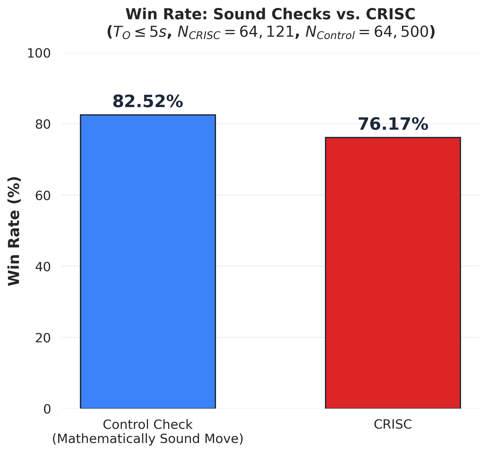
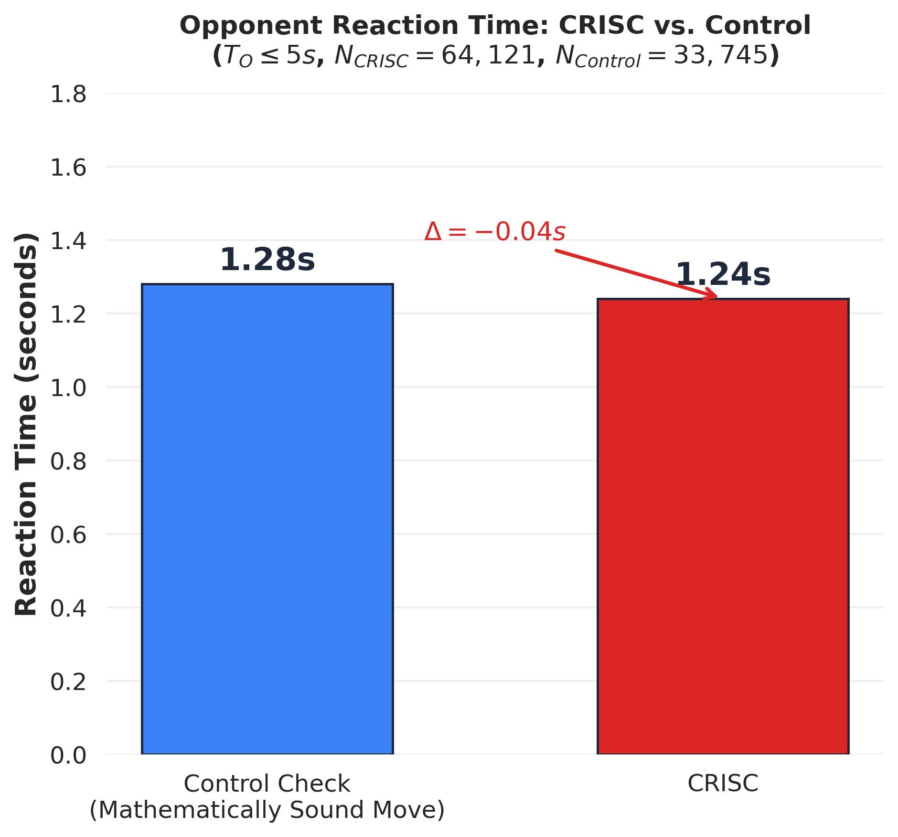

# CRISC: Data Analysis Pipeline for a Time-Scramble Tactic in Online Speed Chess

**[Read the project write-up on my portfolio](https://yelarys.dev/blog/crisc-analysis-pipeline)**

---

## Abstract

This project is a data pipeline that processes **45+ GB of raw Lichess game data** to isolate and analyze a specific time-scramble tactic in online speed chess: the **CRISC** - Contiguous Random Inferior Sacrificial Check, formerly called RISCK - Random Inferior Sacrificial Check to King.

A CRISC is defined as an intentional, objectively inferior piece sacrifice delivered directly adjacent to the opponent's king while the opponent is under extreme time pressure (≤ 5 seconds). Despite being a mathematically losing move (evaluation drop ≥ 400 centipawns), this analysis demonstrates that executing a CRISC yields a **76.17% win rate** across **N = 64,121** verified instances spanning three months of Lichess data (February–April 2026).

### A visual example of CRISC from my dataset:


In a time scramble (≤ 5 seconds), White sacks their Rook with a check contiguous to the opponent's King, which dropped the engine eval by 5.8. White eventually won on time.

### Initial findings from Iteration 1

| Metric | CRISC Group | Control Group |
|---|:---:|:---:|
| **Win Rate** | 76.17% | 82.52% |
| **Reaction Time (R_O)** | 1.24s | 1.28s |
| **Sample Size (N)** | 64,121 | 64,500 |

### Visual Data



> Despite sacrificing material worth ≥ 400 centipawns, CRISC executors retain a 76% win rate — only ~6 percentage points below players who deliver *mathematically sound* checks under identical time pressure.

---

## Methodology: Two-Step Filter

The pipeline uses a two-step filtering approach to isolate true CRISCs from ~270 million games:

### Step 1 — SQL Broad Filter (DuckDB + `aixchess` Extension)
Scans Parquet files to extract all candidate checks meeting:
- **Opponent Time Pressure:** T_O ≤ 5 seconds
- **Objective Blunder:** ΔE ≤ -400 centipawns
- **Forcing Move:** Delivers check

### Step 2 — Python Geometric Filter (`python-chess`)
Rebuilds each board position and verifies:
- **Major Piece:** The checking piece is a Knight, Bishop, Rook, or Queen
- **Geometric Adjacency:** The piece is placed directly adjacent to the opponent's king (`chess.square_distance ≤ 1`)
- **Legally Capturable:** The sacrifice is completely undefended

---

## Tech Stack

| Tool | Role |
|---|---|
| **DuckDB** (v1.5.3 CLI) | High-performance SQL engine for scanning 15GB Parquet files |
| **`aixchess`** | DuckDB community extension for decoding Lichess binary move data |
| **Python 3** | Orchestration, geometric filtering, statistical analysis |
| **`python-chess`** | Board reconstruction and legal move validation |
| **Pandas** | DataFrame operations and CSV aggregation |
| **Matplotlib / Seaborn** | Data visualization |
| **Nix** | Reproducible HPC environment (see `shell.nix`) |
| **Bash** | Data download automation |

---

## Repository Structure

```
crisc-chess/
├── data/                          # Raw Parquet files (not tracked — 45+ GB)
│
├── crisc_sql_filter/              # CRISC group SQL queries
│   └── crisc_sql_filter_YYYY-MM.sql
├── control_filter/                # Control group SQL queries
│   └── control_filter_YYYY-MM.sql
│
├── candidate_criscs/              # Step 1 output — intermediate CSVs (not tracked)
│   └── candidate_criscs_YYYY-MM.csv
├── true_criscs/                   # Step 2 output — verified CRISC datasets
│   └── true_criscs_YYYY-MM.csv
├── control_checks/                # Control group datasets
│   └── control_checks_YYYY-MM.csv
├── results/                       # Final aggregated statistics
│   ├── sensitivity_analysis_results.csv
│   ├── master_scaling_results_T5_E400.csv
│   └── control_group_results_T5.csv
├── visuals/                       # Data visuals
│   ├── fig1_winrate.png
│   └── fig2_reaction.png
│
├── sensitivity_analysis.py        # Threshold permutation orchestrator
├── results_scaler_T5_E400.py      # Multi-month scaling pipeline
├── crisc_geometric_filter.py      # Geometric adjacency filter (python-chess)
├── crisc_winrate.py               # Win rate calculator
├── crisc_opponent_reaction.py     # Opponent reaction time (R_O) calculator
├── control_opponent_reaction.py   # Control group extraction & reaction time
├── control_winrate.py             # Control group win rate calculator
├── generate_visuals.py            # Matplotlib/Seaborn chart generation
├── download_data.sh               # Automated Parquet download script
├── shell.nix                      # Reproducible Nix environment
├── requirements.txt               # A list of external libraries
└── LICENSE                        # MIT License
```

---

## Reproduction

### Path A: Quick Evaluation (Recommended)
This path allows you to run a quick version of the pipeline using a 10,000-row toy dataset (from lichess_2026-04) without downloading the full 45GB data.

1. **Create and activate a virtual environment**:
   ```bash
   python -m venv .venv
   ```
   ```bash
   # Linux / macOS
   source .venv/bin/activate

   # Windows (PowerShell)
   .venv\Scripts\activate
   ```
2. **Install Requirements**:
   ```bash
   pip install -r requirements.txt
   ```
3. **Download DuckDB Binary**:
   Download the DuckDB CLI executable (v1.5.3 or compatible) from the official website (https://duckdb.org/install/?platform=windows&environment=cli) and place the `duckdb` binary directly in the root directory.
4. **Configure for Path A**:
   Modify the *DATA_DIR* variable in the orchestration scripts (`sensitivity_analysis.py` and `results_scaler_T5_E400.py`) to point to `./data_sample` instead of `./data`. In `results_scaler_T5_E400.py`, remove "2026-02" and "2026-03" from the array *months*.
5. **Run Pipeline**:
   Execute:
   ```bash
   python sensitivity_analysis.py
   python results_scaler_T5_E400.py
   python generate_visuals.py
   ```

### Path B: Full Scientific Reproduction (45GB+)
This path performs the full analysis on 270 million games.

1. **Enter the Nix Environment**:
   ```bash
   nix-shell shell.nix
   ```
2. **Download Raw Data**:
   ```bash
   bash download_data.sh
   ```
   This downloads the `low_compression` Parquet files from [thomasd1/aix-lichess-database](https://huggingface.co/datasets/thomasd1/aix-lichess-database) on Hugging Face into the `./data/` directory.
3. **Download DuckDB Binary**:
   Download the DuckDB CLI executable (v1.5.3 or compatible) and place the `duckdb` binary directly in the root directory.
4. **Run the Pipeline**:
   ```bash
   python sensitivity_analysis.py
   python results_scaler_T5_E400.py
   python generate_visuals.py
   ```

---

## Data Source

All data is sourced from [Thomas Daniels' Aix-compatible Lichess Database](https://huggingface.co/datasets/thomasd1/aix-lichess-database) (`low_compression` Parquet format).

---

## License

This project is licensed under the [MIT License](./LICENSE).

## Author

**Yelarys Seidin** — Summer Research Project under Dr. Justin Schroeder at Dakota State University.