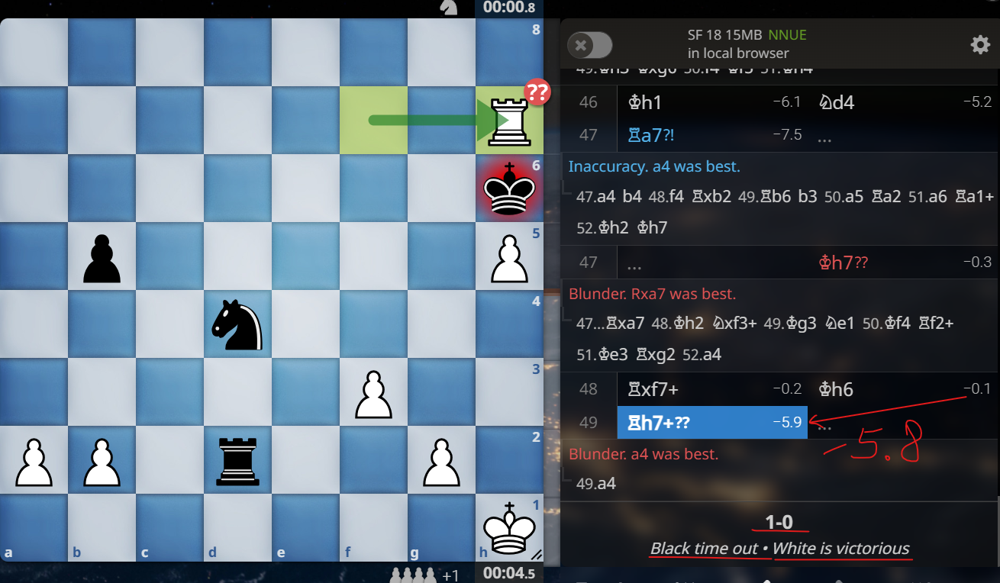

# CRISC: Analyzing a Time-Scramble Tactic in Online Speed Chess

**[Read the project write-up on my portfolio](https://yelarys.dev/blog/crisc-analysis-pipeline)**

---

## Abstract

This project is a data pipeline that processes **45+ GB of raw Lichess game data** (~270 million moves) to isolate and analyze a specific time-scramble tactic in online speed chess: **CRISC** (Contiguous Random Inferior Sacrificial Check, formerly RISCK).

A CRISC is an objectively inferior piece sacrifice delivered directly adjacent to the opponent's king while the opponent is under severe time pressure ($T_O \le 5\text{s}$). Controlling for pre-move position balance ($-150 \le \text{eval} \le +150\text{cp}$) and rating gaps ($|\Delta\text{elo}| \le 200$), this analysis proves that executing a CRISC yields a **+8% to +10% statistically significant win rate lift** ($p < 0.001$) across **N = 10,813** verified instances spanning three months of Lichess data (February–April 2026).

### A visual example of CRISC from my dataset:


In a time scramble (≤ 5 seconds), White sacks their Rook with a check contiguous to the opponent's King, which dropped the engine eval by 5.8. White eventually won on time.

### 3-Month Empirical Findings (Feb–Apr 2026, N = 10,813 CRISCs vs N = 64,500 Baseline)

#### 1. Win Rate Lift Matrix (ΔW = CRISC Win Rate − Baseline Win Rate) & Statistical Significance
*Legend: `***` (p < 0.001), `**` (p < 0.01), `*` (p < 0.05), `ns` (not significant)*

| Elo Tier | <= 5s vs <= 5s | <= 5s vs 5-10s | <= 5s vs 10-15s | <= 5s vs 15-20s |
|---|:---:|:---:|:---:|:---:|
| **< 1000** | +3.18% (ns)<br>`[-5.91%, +12.27%]` | +5.50% (ns)<br>`[-1.88%, +12.89%]` | +0.80% (ns)<br>`[-5.93%, +7.52%]` | +2.36% (ns)<br>`[-0.98%, +5.71%]` |
| **1000 – 1500** | **+8.99%** (\*\*\*) <br>`[+5.32%, +12.65%]` | **+7.07%** (\*\*\*) <br>`[+4.17%, +9.98%]` | +2.63% (ns)<br>`[-0.16%, +5.43%]` | +0.57% (ns)<br>`[-2.29%, +3.42%]` |
| **1500 – 2000** | **+9.73%** (\*\*\*) <br>`[+6.96%, +12.50%]` | **+9.29%** (\*\*\*) <br>`[+6.83%, +11.75%]` | **+4.90%** (\*\*\*) <br>`[+2.60%, +7.36%]` | +1.35% (ns)<br>`[-1.26%, +3.97%]` |
| **> 2000** | **+8.41%** (\*\*\*) <br>`[+6.02%, +10.79%]` | **+9.80%** (\*\*\*) <br>`[+7.08%, +12.51%]` | **+6.01%** (\*\*) <br>`[+2.90%, +9.11%]` | -0.72% (ns)<br>`[-5.16%, +3.71%]` |

#### 2. Pooled Opponent Reaction Time Difference Matrix (ΔR_O = CRISC R_O − Baseline R_O)

| Elo Tier | <= 5s vs <= 5s | <= 5s vs 5-10s | <= 5s vs 10-15s | <= 5s vs 15-20s |
|---|:---:|:---:|:---:|:---:|
| **< 1000** | -0.11s | -0.13s | -0.00s | -0.01s |
| **1000 – 1500** | **-0.21s** | **-0.17s** | **-0.21s** | **-0.15s** |
| **1500 – 2000** | **-0.18s** | **-0.18s** | **-0.17s** | **-0.15s** |
| **> 2000** | **-0.09s** | **-0.12s** | **-0.15s** | **-0.10s** |

### Key Terminology

To maintain strict consistency across both the CRISC and Baseline observational datasets:
- **Player (`player`)**: The side (`'White'` or `'Black'`) executing the move at ply $n$. In the CRISC dataset, this is the player delivering the contiguous sacrificial check. In the Baseline dataset, this is the player making a standard move under identical time-scramble conditions.
- **Opponent (`opponent`)**: The receiving side facing the move at ply $n$, under target time pressure ($T_O \le 5\text{s}$). Their reaction time ($R_O$) is tracked on the subsequent ply ($n+1$).
- **Time Scramble Brackets**: To evaluate both mutual scrambles and clock asymmetries (rather than assuming one-sided time pressure), positions are cross-stratified across 4 clock differential brackets comparing the Opponent clock ($T_O \le 5\text{s}$) against the Player clock ($\le 5\text{s}$, $5-10\text{s}$, $10-15\text{s}$, and $15-20\text{s}$).

---

## Methodology: Four-Step Filter & Statistical Analysis

The pipeline uses a four-step filtering and statistical analysis approach to isolate true CRISCs from ~270 million games, control for confounding variables, and analyze win rates and reaction times:

### Step 1 — SQL Broad Filter (DuckDB + `aixchess` Extension)
Scans raw Parquet files to extract candidate positions for both CRISC and Baseline groups meeting strict integrity constraints:
- **Opponent Time Pressure:** Opponent clock $T_O \le 5\text{s}$, Player clock $\le 20\text{s}$
- **Objective Blunder (CRISC):** Evaluation drop $\Delta E \le -400$ centipawns delivering check
- **Pre-Move Balance Control:** Pre-move evaluation between $-150$ and $+150$ centipawns (eliminates won/lost positions)
- **Fairness Gap Constraint:** Opponent rating difference $| \text{Rating}_{\text{White}} - \text{Rating}_{\text{Black}} | \le 200$ points
- **Statistical Independence:** `QUALIFY ROW_NUMBER() OVER (PARTITION BY lichess_id ORDER BY ply ASC) = 1` (limits to 1 event per game)

### Step 2 — Python Geometric Filter (`python-chess`)
Rebuilds board positions using `python-chess` to isolate True CRISCs:
- **Major Piece:** Checking piece is a Knight, Bishop, Rook, or Queen (non-pawn)
- **Geometric Adjacency:** Checking piece is placed directly adjacent to the opponent's king (`chess.square_distance ≤ 1`)
- **Legally Capturable:** The sacrifice is completely undefended and legally capturable by the opponent

### Step 3 — Win Rate Analysis & Inferential Statistics (`winrate.py`)
Processes True CRISCs and Baseline moves across 4 Elo Tiers (`<1000`, `1000-1500`, `1500-2000`, `>2000`) and 4 Time Scramble Brackets:
- Computes win rates for CRISC and Baseline groups per stratum
- Computes the 2D **Win Rate Lift Matrix** ($\Delta W = W_{\text{CRISC}} - W_{\text{Baseline}}$)
- Computes two-proportion **Chi-Square ($\chi^2$) / Z-tests** ($p$-values) and **95% Confidence Intervals** for every cell

### Step 4 — Pooled Opponent Reaction Time Analysis (`opponent_reaction.py`)
Joins filtered datasets against raw clock arrays in DuckDB across all specified months to measure pooled opponent reaction time ($R_O$):
- Filters out pre-moves ($R_O = 0$) and server underflow artifacts ($R_O < 0$)
- Cross-stratifies pooled $R_O$ across Elo Tiers $\times$ Time Scramble Brackets for both CRISC and Baseline groups
- Computes the 2D **Reaction Time Difference Matrix** ($\Delta R_O = R_{O,\text{CRISC}} - R_{O,\text{Baseline}}$)

---

## Tech Stack

| Tool | Role |
|---|---|
| **DuckDB** (v1.5.3 CLI) | High-performance SQL engine for scanning 15GB Parquet files |
| **`aixchess`** | DuckDB community extension for decoding Lichess binary move data |
| **Python 3** | Orchestration, geometric filtering, statistical analysis |
| **`python-chess`** | Board reconstruction and legal move validation |
| **Pandas** | DataFrame operations and CSV aggregation |
| **Nix** | Reproducible HPC environment (see `shell.nix`) |
| **Bash** | Data download automation |

---

## Repository Structure

```
crisc-chess/
├── data/                          # Raw Parquet files (not tracked — 45+ GB)
├── data_sample/                   # Curated sample Parquet dataset for instant demonstration
│
├── crisc_sql_filter/              # CRISC group SQL queries (auto-generated)
│   └── crisc_sql_filter_{CRISC_PATH_ID}.sql
├── baseline_filter/               # Baseline group SQL queries
│   └── baseline_filter_YYYY-MM.sql
│
├── candidate_criscs/              # Step 1 output — intermediate CSVs (not tracked)
│   └── candidate_criscs_{CRISC_PATH_ID}.csv
├── true_criscs/                   # Step 2 output — verified CRISC datasets
│   └── true_criscs_{CRISC_PATH_ID}.csv
├── baseline_moves/                # Baseline group datasets
│   └── baseline_moves_YYYY-MM.csv
├── visuals/                       # Data visuals (e.g. crisc_repo_cover.png)
│
├── run_pipeline.py                # Unified pipeline orchestrator (argparse CLI)
├── crisc_geometric_filter.py      # Geometric adjacency filter (python-chess)
├── winrate.py                     # Win rate analysis, Chi-Square p-values, and 95% CIs
├── opponent_reaction.py           # Pooled multi-month opponent reaction time (R_O) calculator
├── download_data.sh               # Automated Parquet download script
├── shell.nix                      # Reproducible Nix environment
├── requirements.txt               # A list of external libraries
└── LICENSE                        # MIT License
```

---

## Reproduction

### Path A: Quick Evaluation (Recommended)
This path runs the complete 4-step pipeline in ~2 seconds using the curated `data_sample/` dataset without downloading the 45+ GB data:

1. **Create and activate a virtual environment**:
   ```bash
   python -m venv .venv
   ```
   ```bash
   # Linux / macOS
   source .venv/bin/activate

   # Windows (PowerShell)
   .venv\Scripts\activate
   ```
2. **Install Requirements**:
   ```bash
   pip install -r requirements.txt
   ```
3. **Download DuckDB Binary**:
   Download the DuckDB CLI executable (v1.5.3 or compatible) from the official website (https://duckdb.org/install/?platform=windows&environment=cli) and place the `duckdb` binary directly in the root directory.
4. **Run Pipeline** (single month, quick eval):
   ```bash
   python run_pipeline.py --months 2026-04 --perm T5_E400 --data ./data_sample
   ```

### Path B: Full Scientific Reproduction (45GB+)
This path performs the full analysis on 270 million games.

1. **Enter the Nix Environment**:
   ```bash
   nix-shell shell.nix
   ```
2. **Download Raw Data**:
   ```bash
   bash download_data.sh
   ```
   This downloads the `low_compression` Parquet files from [thomasd1/aix-lichess-database](https://huggingface.co/datasets/thomasd1/aix-lichess-database) on Hugging Face into the `./data/` directory.
3. **Download DuckDB Binary**:
   Download the DuckDB CLI executable (v1.5.3 or compatible) and place the `duckdb` binary directly in the root directory.
4. **Run the Pipeline** (full 3-month analysis):
   ```bash
   python run_pipeline.py --months 2026-02 2026-03 2026-04 --perm T5_E400 --data ./data
   ```

---

## Data Source

All data is sourced from [Thomas Daniels' Aix-compatible Lichess Database](https://huggingface.co/datasets/thomasd1/aix-lichess-database) (`low_compression` Parquet format).

---

## License

This project is licensed under the [MIT License](./LICENSE).

## Author

**Yelarys Seidin** — Summer Research Project under Dr. Justin Schroeder at Dakota State University.